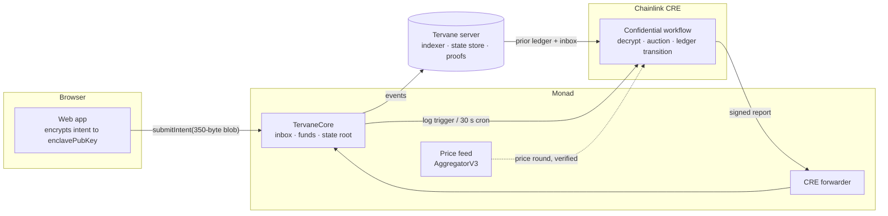

# Tervane

**Fixed-rate credit on Monad, priced by sealed bids.**

Tervane is a private fixed-rate lending market on **Monad**, settled by a **Chainlink CRE confidential workflow**. Lenders and borrowers post **fully encrypted intents** to an onchain inbox. Inside a TEE enclave, a CRE workflow decrypts them and runs a **sealed-bid, uniform-price call auction** for each loan term. It publishes **only the clearing rate**, and writes one signed settlement report per epoch to the `TervaneCore` contract. Positions live in an offchain ledger committed onchain as a **Merkle root**. If settlement ever stops, an **escape hatch** lets everyone exit with a Merkle proof against the last committed root.

> Onchain order books publish every bid, so a lender leaks their cost of capital the moment they post. On Tervane, your rate is visible only to you and a Chainlink CRE enclave. The market still gets a public fixed-rate benchmark: one clearing rate per term, per epoch.

Built for **Monad Metropolis** (Track 01: Onchain Finance & Trading) and the Chainlink **"Best workflow with CRE"** bounty.

---

## Contents

- [How it works](#how-it-works)
- [Monad integration](#monad-integration)
- [Contract addresses (Monad testnet)](#contract-addresses-monad-testnet)
- [Chainlink CRE](#chainlink-cre)
- [Trust model: what each party can see](#trust-model-what-each-party-can-see)
- [Repository layout](#repository-layout)
- [Setup and running](#setup-and-running)
- [Tests and evidence](#tests-and-evidence)
- [Documentation](#documentation)
- [Prior art](#prior-art)
- [License and attribution](#license-and-attribution)

---

## How it works



1. **Seal.** In the browser, the intent (action, term, amount, rate, collateral) is encrypted with ECIES over secp256k1 (HKDF-SHA256 + AES-256-GCM) to the enclave public key **read from `TervaneCore`**, never from our server. The ciphertext is bound to the chain, the contract and the sender. Every intent is the same **350 bytes**.
2. **Post.** `TervaneCore` appends it to a **hash-chained inbox** (`acc[i] = keccak(acc[i−1] ‖ msgHash(i))`). Deposits and withdrawal requests go through the same inbox. Settlement must consume a contiguous prefix of it, so no message can be dropped or reordered.
3. **Clear.** A Chainlink CRE confidential workflow (`handlerInTee`):
   - fetches the prior ledger and new inbox messages from the server and **verifies both against onchain commitments** (Merkle state root, inbox accumulator),
   - decrypts the intents inside the enclave,
   - runs one **uniform-price call auction** per term,
   - applies repayments, liquidations at a **feed-verified price**, and withdrawals.
4. **Settle.** The workflow writes **one signed report per epoch** through the CRE forwarder. Before anything moves, `TervaneCore` re-checks the forwarder, epoch sequence, `prevRoot == stateRoot`, the inbox accumulator, the price round and `asOf` window, and every payout against its onchain withdrawal request.
5. **Exit if needed.** If no epoch settles for `ESCAPE_DELAY`, anyone can activate escape:
   - accounts exit with Merkle proofs,
   - borrowers repay to recover collateral,
   - anyone can liquidate an unhealthy loan,
   - everyone claims what they're owed.

**Market rules (PROTOCOL-SPEC):**
- **Terms:** 7 days, 30 days, and a 10-minute demo term (demo deployments only).
- **Pricing:** everyone matched in a term pays or earns that term's single clearing rate. Interest is fixed for the full term.
- **Credit tiers:** built from repaid volume. They lower the collateral needed to open a loan:

  | Tier | Open at | Liquidated below | Repaid volume needed |
  |---|---|---|---|
  | Bronze | 2.0× | 1.6× | 0 |
  | Silver | 1.8× | 1.45× | 1,000 tUSD |
  | Gold | 1.5× | 1.25× | 5,000 tUSD |
  | Platinum | 1.3× | 1.15× | 20,000 tUSD |

  A borrower can **prove their tier onchain** (`verifyAccount` with a Merkle proof) without revealing their orders or loans.
- **Liquidation:** seizes at most owed + 10% of collateral value; 5% of that goes to the treasury and the rest to lenders pro rata. The borrower keeps any remainder.

---

## Monad integration

### How Tervane uses Monad

- **Monad is the settlement and custody layer.** All funds sit in `TervaneCore` on Monad. Every deposit, sealed intent and withdrawal request is a Monad transaction appended to the onchain inbox. Every state change is a settlement report landing on Monad.
- **Fast, cheap blocks make sealed batch auctions practical.** An intent confirms in about a second in our testnet runs. With the auto-settler (below), a lend or borrow is matched and settled about 15–25 seconds after the user clicks. That's fast enough to run frequent epochs on a fully onchain inbox.
- **Only a Merkle root is published.** `TervaneCore` stores one 32-byte state root per epoch. Balances, orders and loans stay offchain, but every one can be proven against that root on Monad (`verifyAccount`, `verifyLoan`, escape-hatch exits).
- **Prices come from an AggregatorV3 feed on Monad.** The enclave reads the feed through CRE, and the contract checks that the report's price matches that feed round onchain. Demo deployments use a mock feed (`MockV3Aggregator`).

### Engineering for Monad specifically

- **Gas is charged on the gas limit, with no refunds.** Every write in the app and scripts sets an explicit, measured gas limit. The settlement report's limit is sized per epoch from its contents (D-22): base + per payout + per clear + per byte, plus headroom. It was calibrated from onchain traces: a clearing epoch used 130,903 gas, an epoch with one payout 179,496. The web app also **simulates every write (`eth_call`) before the wallet prompt**, so a call that would revert never pays a full gas limit.
- **Storage layout for Monad's cold-access costs.** Hot settlement fields are packed into as few slots as possible: `lastEpoch`, `cursor`, `lastAsOf`, `lastSettleAt` fill one slot, and `lastPriceRoundId`, `inboxCount`, `escaped` share another.
- **Monad's RPC caps `eth_getLogs` at 100 blocks.** The server indexes in ≤ 100-block ranges, forward from the deploy block, and keeps its own copy of state. Nothing in the design needs historical `eth_call` state.
- **Monad Foundry.** Contracts are built and tested with Foundry using `network = "monad"`, `evm_version = "prague"`, so gas tests use Monad's gas model.
- **No global mempool.** Monad has no global mempool, and intents carry nothing tradable: there's nothing in a blob to front-run. Together these remove classic sandwiching of fills.

### Deployment

- **Network:** Monad **testnet**, chain id `10143`, RPC `https://testnet-rpc.monad.xyz`. Tervane is **not deployed to Monad mainnet**.
- **Deploy:** `contracts/script/Deploy.s.sol` (Foundry) deploys `TestToken` tUSD (6 dp) and tETH (18 dp), the mock price feed and `TervaneCore`. It points `TervaneCore` at the CRE simulation forwarder and writes `deployments/monad-testnet.json`. Every app, script and settler config reads addresses from that file.
- **Settlement:** reports come from the CRE CLI simulator with `--broadcast` (`cre workflow simulate`), so each settlement is a real Monad testnet transaction through the CRE forwarder. Tervane is **not** deployed on the live CRE network (Confidential Workflows is a private beta).

---

## Contract addresses (Monad testnet)

**Current deployment** (the one in the demo video; `deployments/monad-testnet.json`):

| Contract | Address |
|---|---|
| `TervaneCore` | [`0x1b9F7279d42a69Bca007a09153E71b212f778443`](https://testnet.monadscan.com/address/0x1b9F7279d42a69Bca007a09153E71b212f778443) |
| tUSD (`TestToken`, 6 dp) | [`0xC6e2B56b2108d932e993AbB4b74950c9Df284067`](https://testnet.monadscan.com/address/0xC6e2B56b2108d932e993AbB4b74950c9Df284067) |
| tETH (`TestToken`, 18 dp) | [`0x6131B61dC88C6431216b7ecf0B0BE9c3A19DBFfF`](https://testnet.monadscan.com/address/0x6131B61dC88C6431216b7ecf0B0BE9c3A19DBFfF) |
| Price feed (`MockV3Aggregator`, 8 dp) | [`0xdBf3B5e247566Cf4fb8Fe4A94Ddc4D2c9ad52b1a`](https://testnet.monadscan.com/address/0xdBf3B5e247566Cf4fb8Fe4A94Ddc4D2c9ad52b1a) |
| CRE forwarder used for reports (Chainlink `MockKeystoneForwarder`) | [`0xB9F79d863261869B234c481D1f9A7af84AeAd192`](https://testnet.monadscan.com/address/0xB9F79d863261869B234c481D1f9A7af84AeAd192) |
| CRE production forwarder on Monad testnet (`KeystoneForwarder`, for a real CRE deployment) | `0xF8344CFd5c43616a4366C34E3EEE75af79a74482` |

**Earlier end-to-end runs** (archived in `deployments/archive/`):

| Run | `TervaneCore` | What it proved |
|---|---|---|
| Gate 5: scenarios 1–8 | `0x062836764f4B81B34D4BCe5DfeA100D96061B6b8` | Sealed book clears at 5.27%, repay, liquidation, capped withdrawal, tampered server rejected, forged report rejected, escape exit |
| Gate 6: browser end to end | `0x928cd03Fab678558217810dC2c68a4235b044464` | The whole flow driven from the web app |
| Gate 7: escape hatch | `0x4e6199d5aE0908ADEEf21D65228B6D560589783a` | Exits, escape repay, third-party escape liquidation, claims; contract ends at 0 tUSD / 0 tETH |

Transaction hashes for each run are in [`docs/DECISIONS.md`](docs/DECISIONS.md) (Phase 5 and Phase 7 logs). The contracts are not yet source-verified on an explorer.

---

## Chainlink CRE

CRE is Tervane's settlement layer: no deposit, match, repayment, liquidation or withdrawal takes effect without a report from the workflow. It's a single workflow (`settler/settle`) with two triggers:

- an **EVM log trigger** on `TervaneCore` inbox events, so an intent settles promptly;
- a **30-second cron** heartbeat.

What happens in one execution:
- **Inside the enclave (`handlerInTee`):** it fetches its decryption key and server credential as CRE secrets, pulls the prior ledger and new inbox messages from the server over HTTP, and verifies them against the onchain root and accumulator. It then decrypts the intents, runs the auction and transition, and builds the report.
- **On the DON:** it signs the report, and `writeReport` delivers it through the forwarder.
- **No logging in production:** nothing is logged inside the enclave unless `debugLogs` is on. Even then only counts and codes are logged, never a decrypted payload.

Tooling: CRE CLI ≥ 1.30 (verified 1.36.0), `@chainlink/cre-sdk` 1.23.0. The live demo uses `scripts/demo/autosettle.ts` to play the triggers locally. It runs one `cre workflow simulate --broadcast` epoch whenever a new inbox message is indexed or the price changes, plus a heartbeat.

---

## Trust model: what each party can see

| Data | Public chain | Server operator | CRE DON operators | Enclave (during execution) |
|---|---|---|---|---|
| Lend minimums / borrow maximums | no | no | no | yes |
| Clearing rate + volume per term | yes | yes | yes | yes |
| Intent action, term, amount, collateral | no (fixed-size ciphertext) | yes (ledger) | no | yes |
| Who submitted an intent, and when | yes | yes | yes | yes |
| Deposits and withdrawal requests | yes | yes | yes | yes |
| Balances, orders, loans, tiers | no (only a Merkle root) | yes | no | yes |

- **Positions are private from the public chain, not from our server.** Rates are visible only to you and the enclave. Only the clearing rate is published, and bids that don't fill are never revealed.
- **Our server can't read your rate, and can't alter or drop your intent.** The enclave checks the server's data against the onchain root and inbox accumulator before using it.
- **Every payout needs an onchain withdrawal request and is capped by it**, so the enclave can't silently pay arbitrary addresses.
- **If settlement stops, everyone can exit with a Merkle proof.**

Honest limits:
- Confidentiality relies on the TEE.
- Generating the enclave key is a trusted setup step.
- The server sees plaintext positions.
- Deposit sizes are public and can hint at intent sizes.

See [`docs/THREAT-MODEL.md`](docs/THREAT-MODEL.md).

---

## Repository layout

```
tervane/
├── packages/core/     Pure TypeScript shared by settler, server, web and tests: encodings, ECIES, ledger
│                      transition, auction, Merkle tree, math, parameters. QuickJS-safe (runs inside CRE).
├── contracts/         Foundry: TervaneCore, TestToken, MockV3Aggregator, vendored CRE receiver; unit, fuzz,
│                      invariant, golden-vector parity and gas tests; Deploy.s.sol
├── settler/           CRE project: the `settle` confidential workflow (log trigger + cron)
├── server/            Bun + Hono + SQLite: indexer, ledger state store, Merkle proofs, EIP-712 account views
├── web/               React + Vite + wagmi/viem: landing page and the app (Market, Lend, Borrow, Wallet,
│                      Positions, Credit, Escape)
├── scripts/           Demo and ops scripts: deploy config, auto-settler, scenarios, leak audit, Gate 7
├── deployments/       Deployed addresses (monad-testnet.json) and archived runs
└── docs/              Spec set: architecture, protocol spec, workflow, contracts, server, client, threat model
```

`packages/core` is the heart. The enclave, the server and the tests run the **same** transition and Merkle code, and golden vectors generated in TypeScript are checked byte for byte by the Solidity tests.

---

## Setup and running

### Prerequisites

- [Bun](https://bun.sh) (latest; verified 1.4.2)
- [Foundry](https://getfoundry.sh) ≥ 1.8 (verified 1.8.4)
- [Chainlink CRE CLI](https://docs.chain.link/cre) ≥ 1.30 (verified 1.36.0), then `cre login`
- A Monad testnet account with MON for gas: about 1 MON for a fresh deploy, and roughly 0.02 MON per epoch

### Install

```bash
git clone https://github.com/Enochflames/Tervane.git && cd Tervane
git submodule update --init --recursive     # contracts/lib: OpenZeppelin v5.4.0, forge-std v1.17.0
bun install                                 # all workspaces
cp settler/.env.example settler/.env        # then fill it in (never commit it)
```

`settler/.env`:

| Variable | Purpose |
|---|---|
| `CRE_ETH_PRIVATE_KEY` | Deployer, and the account that sends simulated reports |
| `TERVANE_ENCLAVE_SK` | Enclave secret key; the deploy publishes its public key on `TervaneCore` |
| `TERVANE_SERVER_API_KEY` | Bearer key between the settler and the server's internal API |
| `MONAD_TESTNET_RPC` | Optional; defaults to `https://testnet-rpc.monad.xyz` |

### Test

```bash
cd packages/core && bun test        # vectors, ledger, auction, 10k-case property tests
cd contracts && forge test          # parity, unit, escape, fuzz, invariants, gas
cd server && bun test
cd settler/settle && bun test
```

### Deploy to Monad testnet

```bash
set -a; . settler/.env; set +a
export DEPLOYER_PK="0x${CRE_ETH_PRIVATE_KEY#0x}"
cd contracts && forge script script/Deploy.s.sol:Deploy --rpc-url monad_testnet \
  --gas-estimate-multiplier 115 --broadcast --slow && cd ..
bun scripts/gen-settler-config.ts --server http://localhost:8787   # settler config for the new deployment
```

### Run the app (three terminals)

```bash
# 1. server
set -a; . settler/.env; set +a
export INTERNAL_API_KEY="$TERVANE_SERVER_API_KEY"; unset CRE_ETH_PRIVATE_KEY TERVANE_ENCLAVE_SK
cd server && DB_PATH="$PWD/data/<deployment>.db" bun src/main.ts       # :8787; one database per deployment

# 2. auto-settler: one CRE epoch per new inbox message / price change, plus a 5-minute heartbeat
set -a; . settler/.env; set +a
bun scripts/demo/autosettle.ts

# 3. web app
cd web && bun run dev                                                  # http://localhost:5173/app
```

Use a **new database file for each new deployment**, and keep it: settled epochs can't be rebuilt without the stored states, because intents are encrypted.

If port 8787 is taken, use another port everywhere:
- terminal 1: `PORT=8797`
- terminal 2: `TERVANE_SERVER_PORT=8797`, after `gen-settler-config.ts --server http://localhost:8797`
- `web/.env.local`: `VITE_SERVER_URL=http://localhost:8797`

To run a single epoch by hand instead of the auto-settler:

```bash
cd settler && cre workflow simulate settle --target staging-settings --non-interactive --trigger-index 1 --broadcast -v
```

> Use `-v`, never `--engine-logs`: the simulator's engine logs include the server API key.

### Try it

[`userflow.md`](userflow.md) is a seven-step browser test with two wallets:
- deposit, then a sealed lend and a sealed borrow in the same term,
- the match,
- repay, or a price crash and liquidation (`bun scripts/demo/03-crash-price.ts 1800`),
- withdrawal, then the credit proof.

### One-command runs

```bash
set -a; . settler/.env; set +a
bun scripts/demo/run-all.ts      # fresh deploy + scenarios 1–8 + leak audit (~20 min)
bun scripts/demo/run-gate7.ts    # escape hatch end to end on its own deployment (~15 min)
```

---

## Tests and evidence

| Suite | Result |
|---|---|
| `packages/core` | 44 tests, including golden vectors and 10,000-case property tests |
| `contracts` | 52 tests: TS↔Solidity parity on golden vectors, unit, fuzz, handler-based invariants (incl. exact post-escape solvency), gas |
| `server` | 12 tests (fake chain + the real transition as the enclave) |
| `settler/settle` | 6 tests (`settleEpoch` against fake chain and server) |
| Leak audit (`scripts/audit-leaks.ts`) | Every bid used in a run, searched as decimal, percent, hex and uint32 in simulator output, server log, database, calldata and events: **0 hits**. Only the clearing rate appears, by design. |
| Testnet gates | Gates 0–7 passed on Monad testnet; evidence in [`docs/DECISIONS.md`](docs/DECISIONS.md) |

---

## Documentation

| Doc | What's in it |
|---|---|
| [`docs/ARCHITECTURE.md`](docs/ARCHITECTURE.md) | Trust domains, components, every data flow, state machine |
| [`docs/PROTOCOL-SPEC.md`](docs/PROTOCOL-SPEC.md) | Byte-exact encodings, crypto, ledger, Merkle tree, auction, interest, tiers, liquidation, report ABI |
| [`docs/CRE-WORKFLOW.md`](docs/CRE-WORKFLOW.md) | The settler workflow: CRE APIs, TEE rules, config, secrets, quotas |
| [`docs/CONTRACTS.md`](docs/CONTRACTS.md) | `TervaneCore` storage, checks, escape hatch, tests, deploy |
| [`docs/SERVER.md`](docs/SERVER.md) / [`docs/CLIENT.md`](docs/CLIENT.md) | Server and web client |
| [`docs/THREAT-MODEL.md`](docs/THREAT-MODEL.md) | Adversaries, trust assumptions, what we may and may not claim |
| [`docs/DECISIONS.md`](docs/DECISIONS.md) | Decision records, open questions, testnet run logs |
| [`docs/DEMO-SCRIPT.md`](docs/DEMO-SCRIPT.md) | Demo video script and judge walkthrough |
| [`userflow.md`](userflow.md) | Step-by-step end-to-end test |

---

## Prior art

[Ghost Finance](https://github.com/snehendu098/ghost) (Apache-2.0) is public prior art with the same core concept: private lending matched by Chainlink CRE. Tervane is a clean-room implementation. No code, text or documentation was taken from it.

---

## License and attribution

Tervane is released under the [MIT License](LICENSE).

It builds on the following external code and libraries, each under its own license:

| Component | Used for | License |
|---|---|---|
| [`@chainlink/cre-sdk`](https://www.npmjs.com/package/@chainlink/cre-sdk) 1.23.0 | The settler workflow (`settler/settle`) | **BUSL-1.1** (Business Source License, © SmartContract Chainlink Ltd). Not covered by Tervane's MIT license; its terms apply to that dependency. |
| Chainlink CRE CLI | Workflow simulation and broadcast | Chainlink terms |
| `ReceiverTemplate.sol`, `IReceiver.sol`, `IERC165.sol` in `contracts/src/cre/` | Report receiver base for `TervaneCore`, vendored unmodified from the Chainlink CRE docs | MIT |
| `AggregatorV3Interface` in `contracts/src/interfaces/` | The Chainlink price-feed interface (the subset Tervane reads); `MockV3Aggregator` implements it for demos | MIT |
| [OpenZeppelin Contracts](https://github.com/OpenZeppelin/openzeppelin-contracts) v5.4.0 | `ERC20` + `ERC20Permit` (test tokens), `Ownable`, `SafeERC20`, `MerkleProof`, `ReentrancyGuardTransient` | MIT |
| [forge-std](https://github.com/foundry-rs/forge-std) v1.17.0 | Foundry tests and scripts | MIT or Apache-2.0 |
| [@noble/curves, hashes, ciphers](https://paulmillr.com/noble/) 2.4.0 | secp256k1 ECIES, HKDF-SHA256, AES-256-GCM | MIT |
| [viem](https://viem.sh) 2.57 | ABI encoding, keccak, RPC clients | MIT |
| [Hono](https://hono.dev) 4.13 | Server HTTP framework | MIT |
| [zod](https://zod.dev) 3.25 | Config and request validation | MIT |
| [React](https://react.dev) 19, [React Router](https://reactrouter.com) 7 | Web app | MIT |
| [wagmi](https://wagmi.sh) 3, [TanStack Query](https://tanstack.com/query) 5 | Wallet connection and data fetching | MIT |
| [Vite](https://vite.dev) | Web build and dev server | MIT |
| [fast-check](https://fast-check.dev) | Property-based tests | MIT |
| [Geist / Geist Mono](https://vercel.com/font), [Instrument Serif](https://fonts.google.com/specimen/Instrument+Serif) (via Fontsource) | Web typography | SIL Open Font License 1.1 |
| [Bun](https://bun.sh), [Foundry](https://getfoundry.sh), [TypeScript](https://www.typescriptlang.org) | Runtime, contract toolchain, language | MIT / MIT or Apache-2.0 / Apache-2.0 |

Monad, Chainlink and other names are trademarks of their respective owners. Tervane is an independent hackathon project and is not affiliated with or endorsed by either.
