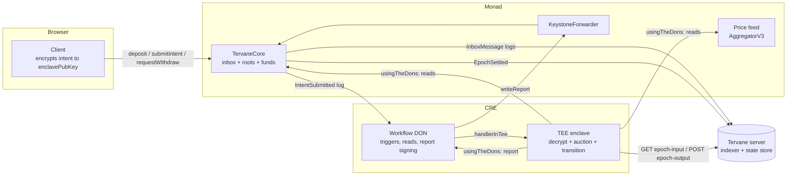
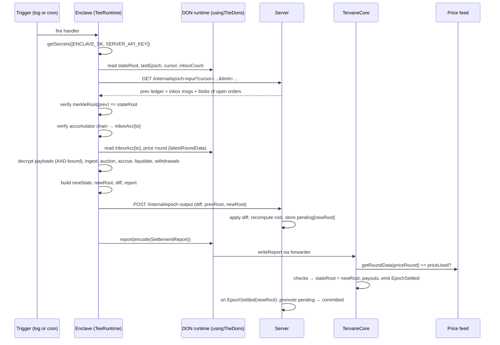
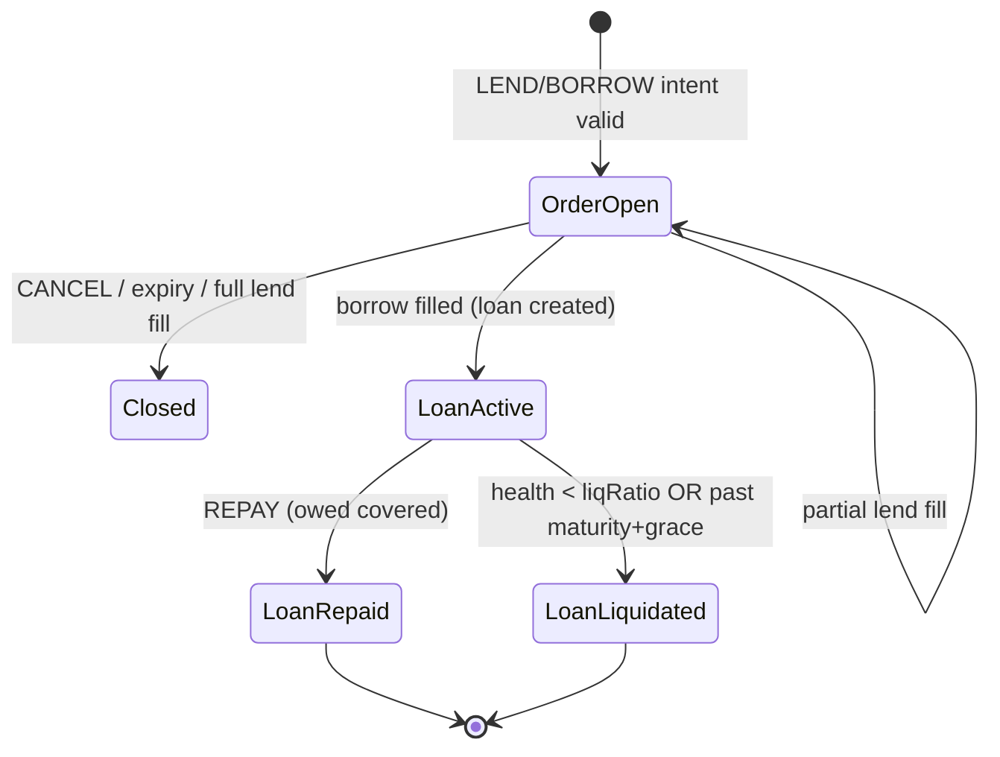

# Tervane — Architecture

This document explains how the system fits together and why. Exact encodings live in `PROTOCOL-SPEC.md`; this doc references section numbers there as `[SPEC §n]`.

---

## 1. The one-paragraph model

Tervane is a **validium-style lending market with a confidential sequencer**. Funds sit in one contract on Monad (`TervaneCore`). Every user action that matters enters an **onchain inbox** with a hash-chained accumulator, so nobody can drop or reorder it. Lend and borrow intents are **encrypted end-to-end** to an enclave key; the chain sees only an opaque blob. Every epoch, a CRE **Confidential Workflow** pulls the previous ledger state and the new inbox messages, verifies both against onchain commitments, decrypts the intents inside a TEE, runs the auction, applies repayments/liquidations/withdrawals, and writes a single signed report that moves `stateRoot` forward and pays out withdrawals. The server is a blind-to-rates indexer and state store whose integrity is checked by Merkle roots on both sides. If the sequencer stops, an escape hatch lets users exit with Merkle proofs against the last root.

---

## 2. Trust domains

| Domain | Component | Can see | Can do | Cannot do |
|---|---|---|---|---|
| **Chain** | `TervaneCore` on Monad testnet | Deposits, withdrawal requests, ciphertext blobs, roots, clearing rates | Hold funds; accept reports only from the forwarder; enforce sequencing, accumulator, price-round and payout ceilings; run escape hatch | Read rates, amounts inside intents, positions |
| **Enclave** | CRE Confidential Workflow `settle` (`handlerInTee`) | Everything, transiently, during one execution | Compute the next state and the report | Persist anything; pay anyone who didn't request a withdrawal; exceed requested amounts; skip or reorder inbox messages; lie about price |
| **DON** | CRE Workflow DON | Report payload, chain reads, trigger data | Sign and deliver the report via the forwarder | Read enclave memory or decrypted intents |
| **Server** | Bun + Hono + SQLite | Plaintext ledger (balances, orders' sizes, loans), ciphertext blobs | Index chain, store state, serve proofs and authenticated account views | Read any bid/max rate; forge state (root check); censor one user without halting everyone |
| **Client** | Web app in user's browser | The user's own plaintext intents and rates | Encrypt to the onchain enclave key, submit to chain | — |
| **Owner** | Deployer key | — | Set enclave public key, forwarder, workflow id, escape delay (timelocked in prod) | Move user funds |

The key property: **no domain can both read rates and move funds**, and **every domain that moves state is checked by another**.

---

## 3. Components

### 3.1 `TervaneCore` (Solidity, Monad)
Holds tUSD and tETH. Exposes `deposit`, `submitIntent(bytes blob)`, `requestWithdraw`, plus escape-hatch functions. Inherits Chainlink's `ReceiverTemplate`; `_processReport` validates and applies a `SettlementReport` [SPEC §11]. Stores: `stateRoot`, `lastEpoch`, `cursor`, `inboxCount`, `inboxAcc[i]`, `pendingWithdraw[user][asset]`, `lastSettleAt`, `enclavePubKey`, escape bookkeeping. Detail: `CONTRACTS.md`.

### 3.2 `settle` workflow (CRE, TypeScript → WASM)
One workflow, two handlers, both `handlerInTee`:
- **H0 — log trigger** on `InboxMessage` with `kind == INTENT`: settle promptly after an intent lands.
- **H1 — cron `*/30 * * * * *`**: settle deposits, withdrawals, maturities, liquidations, and act as the heartbeat even when idle.

Both call the same `runEpoch(teeRuntime)`. One workflow (not three) because: one workflow id to pin onchain; one place for the state machine; the private registry allows only 3 workflows per org. Detail: `CRE-WORKFLOW.md`.

### 3.3 `packages/core` (pure TS)
The state transition, auction, Merkle tree, encodings, crypto. Imported by settler, server, web, scripts, and Foundry vector generation. **The same code runs in the enclave and on the server**, which is why the server can verify the enclave's claimed root and vice versa.

### 3.4 Server (Bun + Hono + SQLite)
- **Indexer**: follows `InboxMessage`, `EpochSettled`, escape events from the deploy block forward.
- **State store**: committed ledger per root; pending ledgers keyed by root until `EpochSettled` confirms.
- **Internal API** (enclave only, bearer secret from Vault DON): `GET /internal/epoch-input`, `POST /internal/epoch-output`.
- **Public API**: market data; EIP-712-authenticated account views and Merkle proofs.
Detail: `SERVER.md`.

### 3.5 Web client
Reads `enclavePubKey` from chain, encrypts the full intent payload with AAD bound to `(chainId, core, sender)`, submits directly to `TervaneCore`. Keeps the user's own rates in local storage so the UI can show "your bid: 4.10%" without the server ever knowing. Detail: `CLIENT.md`.

---

## 4. Data flows

### 4.1 Deposit
1. User `approve` + `TervaneCore.deposit(asset, amount)`.
2. Contract pulls tokens, appends inbox message `DEPOSIT` [SPEC §4], updates `inboxAcc`, emits `InboxMessage`.
3. Next epoch, enclave credits `free[asset]` in the ledger.

Public: depositor, asset, amount. That is unavoidable for an ERC-20 transfer into a public contract and is stated in the threat model.

### 4.2 Submit intent (lend / borrow / cancel / repay)
1. Client builds `IntentPayload` [SPEC §5], encrypts it [SPEC §6] with AAD = `(chainId, core, msg.sender)`.
2. Client calls `submitIntent(blob)`. Contract appends `INTENT` message with `blobHash = keccak256(blob)`, emits `InboxMessage(index, INTENT, sender, 0, 0, blob)`.
3. The log fires H0. Server also indexes the blob.

Public: that `sender` submitted *some* intent of ~fixed size. Side, tenor, amount, rate, collateral are all hidden. Padding to a fixed plaintext length [SPEC §5.3] removes size side-channels between action types.

### 4.3 Epoch settlement (the core loop)

Ordering matters: **POST the diff before writing the report**. If the write fails, the pending state is garbage-collected; if the POST fails, nothing is written and the next trigger retries. The reverse order could commit a root the server can't reconstruct, stalling the system.

### 4.4 Withdrawal
1. User `requestWithdraw(asset, amount)`: increments `pendingWithdraw[user][asset]`, appends `WITHDRAW` message.
2. Enclave processes it: pays `min(requested, free)`; emits `Payout{to, asset, requested, paid}` in the report.
3. Contract checks `requested <= pendingWithdraw`, decrements by `requested`, transfers `paid`.

Defense in depth: the contract pays only addresses that requested onchain, up to what they requested. That stops silent payouts to arbitrary addresses and makes theft attributable; it does not stop an attacker who controls the enclave and also requests from their own address (THREAT-MODEL A4).

### 4.5 Matching (inside 4.3)
Per tenor, a **uniform-price call auction** over all open lend and borrow orders [SPEC §8]. Lend orders sorted ascending by min rate; borrow orders descending by max rate; borrows fill whole-or-nothing from the cheapest remaining lend slices; the clearing rate `r*` is the highest lend slice consumed. Every matched lender earns `r*`; every matched borrower pays `r*`. Unfilled orders stay open with their rates still encrypted; their plaintext is never written anywhere.

### 4.6 Repayment
`REPAY` intent with `loanId`. Borrower's `free.usd` must cover `owed` [SPEC §9]. Lenders are credited principal + interest pro rata; collateral unlocks; `repaidVolume` grows; tier may upgrade [SPEC §10].

### 4.7 Liquidation
Every epoch, for each active loan: liquidate if `health < liqRatio(tierAtOpen)` at the verified price, or if `asOf > maturity + GRACE`. Seize `min(collateral, owed × 1.10 / price)`; 5% to treasury, 95% to lenders pro rata; remainder unlocks to the borrower; tier drops one level [SPEC §10.4].

### 4.8 Escape hatch
If `block.timestamp > lastSettleAt + ESCAPE_DELAY`, anyone can call `activateEscape()`. From then on reports are rejected and:
- `exitAccount(leaf, proof)` pays the account's free + reserved balances.
- `escapeRepay(loanLeaf, shares, proof)` lets a borrower repay onchain and reclaim collateral.
- `escapeLiquidate(loanLeaf, shares, proof)` lets anyone liquidate an unhealthy or matured loan against the onchain feed.
- `claim()` pays lenders their accrued claims.

Proof data comes from the server's `/v1/proof` endpoint (or the client's cached copy from its last successful view). This is the data-availability assumption, stated in the threat model.

---

## 5. Ledger state machine

Invalid intents (bad AAD, stale nonce, insufficient balance, unknown tenor, over tier cap) are **consumed and ignored**: the inbox cursor advances past them and nothing else changes. Garbage can't stall the system.

---

## 6. Why these choices (short form; long form in `DECISIONS.md`)

- **Full-payload encryption, not just the rate.** Hiding the rate while publishing side/amount/collateral would leave positions visible on the chain. Encrypting everything costs nothing extra.
- **Onchain inbox + accumulator.** Removes the server from the censorship path: the enclave must ingest a contiguous prefix verified against `inboxAcc`. Withholding one message halts everyone, which trips the escape hatch, so censorship is self-defeating.
- **Merkle-committed ledger.** Lets the server be untrusted for integrity, enables escape exits, and gives users a **selectively disclosable credit record** (prove your tier against `stateRoot` without revealing anything else) — the "lending priced on onchain credit history" angle for Track 01.
- **Call auction without proposals.** The borrower's max rate is sealed and binding; there is no accept/reject step, so there is no free option to probe rates. The 5% rejection penalty from the earlier write-up becomes unnecessary.
- **One workflow, two triggers.** Prompt settlement on intents plus a 30 s heartbeat, one onchain workflow identity, within registry limits.
- **Offchain matching, onchain enforcement (Track 01 framing).** Track 01 celebrates fully onchain order books. Tervane deliberately keeps matching offchain because an onchain book publishes every bid, which is exactly what sealed bids exist to prevent. The chain still constrains the matcher: contiguous inbox via accumulator, root sequencing, verified price rounds, payout ceilings. Lead with this contrast instead of defending against it.
